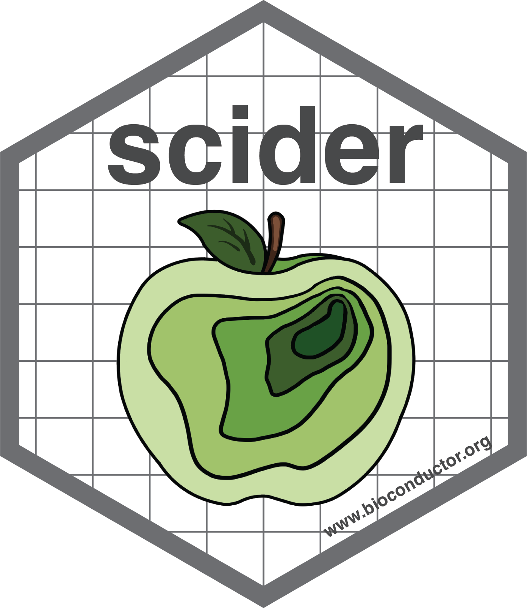

# scider: Spatial cell-type inter-correlation by density in R. 

[](https://github.com/ChenLaboratory/scider/actions)
[](https://app.codecov.io/gh/ChenLaboratory/scider?branch=devel)

*scider* implements functions to analyse spatial transcriptomics 
data with cell type annotations by performing cell type 
correlation via density estimation and cell type co-localization 
via real number distance. Functions include density 
estimation, statistical modelling and visualizations.

Install released version form Bioconductor

```
if (!require("BiocManager", quietly = TRUE))
    install.packages("BiocManager")

BiocManager::install("scider")
```


Install development version from GitHub

```
library(devtools)   
devtools::install_github("ChenLaboratory/scider")
```
