# A quick start guide to the scider package

scider is an user-friendly R package providing functions to model the
global density of cells in a slide of spatial transcriptomics data. All
functions in the package are built based on the SpatialExperiment
object, allowing integration into various spatial
transcriptomics-related packages from Bioconductor. After modelling
density, the package allows for serveral downstream analysis, including
colocalization analysis, boundary detection analysis and differential
density analysis.

## Installation

``` r

if (!require("BiocManager", quietly = TRUE)) {
    install.packages("BiocManager")
}

BiocManager::install("scider")
```

The development version of `scider` can be installed from GitHub:

``` r

devtools::install_github("ChenLaboratory/scider")
```

## Quick start

``` r

library(scider)
library(SpatialExperiment)
```

## Load data

In this vignette, we will use a subset of a Xenium Breast Cancer
dataset.

``` r

data("xenium_bc_spe")
```

In the data, we have quantification of 541 genes from 10000 cells.

``` r

spe
```

    ## class: SpatialExperiment 
    ## dim: 541 10000 
    ## metadata(0):
    ## assays(1): counts
    ## rownames(541): ENSG00000121270 ENSG00000213088 ... BLANK_0444
    ##   BLANK_0447
    ## rowData names(3): ID Symbol Type
    ## colnames(10000): cell_212124 cell_120108 ... cell_252054 cell_568560
    ## colData names(21): cell_id transcript_counts ... cell_type sample_id
    ## reducedDimNames(0):
    ## mainExpName: NULL
    ## altExpNames(0):
    ## spatialCoords names(2) : x_centroid y_centroid
    ## imgData names(1): sample_id

We also have cell-type annotations of these cells, there are 4 cell
types.

``` r

table(colData(spe)$cell_type)
```

    ## 
    ##       B cells Breast cancer   Fibroblasts       T cells 
    ##           643          3550          4234          1573

We can use the function `plotSpatial` to visualise the cell position and
color the cells by cell types.

``` r

plotSpatial(spe, group.by = "cell_type", pt.alpha = 0.8)
```

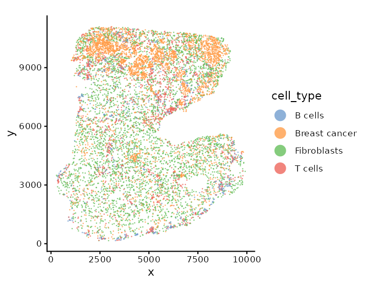

## Grid-based analysis

`scider` can conduct grid-based density analysis for spatial
transcriptomics data.

### Density calculation

We can perform density calculation for each cell type using function
`gridDensity`. The calculated density and grid information are saved in
the metadata of the SpatialExperimnet object.

``` r

spe <- gridDensity(spe)
names(metadata(spe))
```

    ## [1] "grid_density" "grid_info"

``` r

metadata(spe)$grid_density
```

    ## DataFrame with 12319 rows and 10 columns
    ##          x_grid    y_grid    node_x    node_y        node density_b_cells
    ##       <numeric> <numeric> <numeric> <numeric> <character>       <numeric>
    ## 1       280.937   155.873         1         1         1-1      0.00161274
    ## 2       380.937   155.873         2         1         2-1      0.00211721
    ## 3       480.937   155.873         3         1         3-1      0.00277295
    ## 4       580.937   155.873         4         1         4-1      0.00364209
    ## 5       680.937   155.873         5         1         5-1      0.00482578
    ## ...         ...       ...       ...       ...         ...             ...
    ## 12315   9480.94   11067.8        93       127      93-127     0.001135422
    ## 12316   9580.94   11067.8        94       127      94-127     0.000741773
    ## 12317   9680.94   11067.8        95       127      95-127     0.000466692
    ## 12318   9780.94   11067.8        96       127      96-127     0.000284044
    ## 12319   9880.94   11067.8        97       127      97-127     0.000167953
    ##       density_breast_cancer density_fibroblasts density_t_cells density_overall
    ##                   <numeric>           <numeric>       <numeric>       <numeric>
    ## 1               5.08804e-05          0.00290209     0.000991062      0.00555677
    ## 2               9.86082e-05          0.00414279     0.001464630      0.00782324
    ## 3               1.89630e-04          0.00583797     0.002155848      0.01095640
    ## 4               3.59094e-04          0.00810256     0.003155203      0.01525895
    ## 5               6.65018e-04          0.01104941     0.004584676      0.02112489
    ## ...                     ...                 ...             ...             ...
    ## 12315            0.01190884          0.01354203     2.00058e-05      0.02660629
    ## 12316            0.00737930          0.00901015     9.48948e-06      0.01714072
    ## 12317            0.00452586          0.00581520     4.56708e-06      0.01081232
    ## 12318            0.00275608          0.00365773     2.28099e-06      0.00670013
    ## 12319            0.00167020          0.00225250     1.20181e-06      0.00409186

We can visualise the overall cell density of the whole tissue using
function `plotDensity`.

``` r

plotDensity(spe)
```

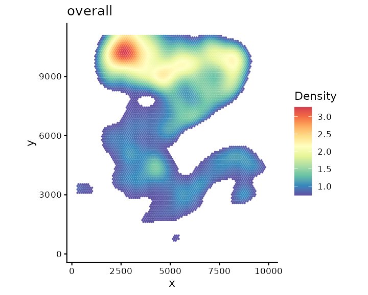

We can also visualise the density of individual cell type, e.g.,
fibroblast cells.

``` r

plotDensity(spe, coi = "Fibroblasts")
```

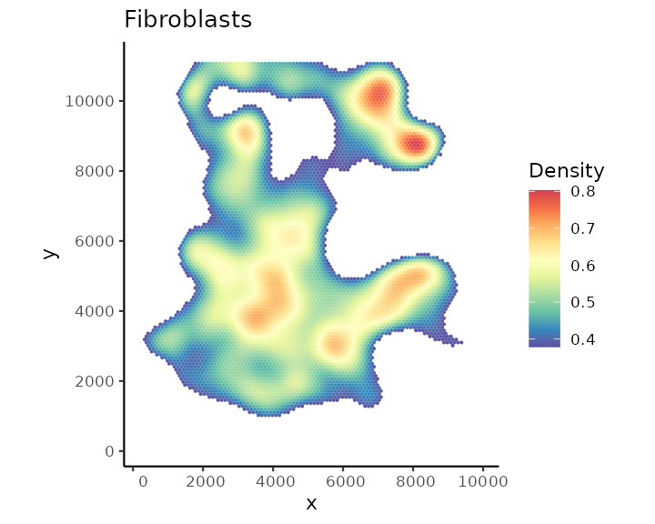

### Find Regions-of-interest (ROIs)

After obtaining grid-based density for each COI, we can then detect
regions-of-interest (ROIs) based on density or select by user.

#### Detected by algorithm

To detect ROIs automatically, we can use the function `findROI`.

The detected ROIs are saved in the metadata of the SpatialExperiment
object.

Here we identify ROIs based on the fibroblasts cell density.

``` r

spe <- findROI(spe, coi = "Fibroblasts")
metadata(spe)$fibroblasts_roi
```

    ## DataFrame with 1833 rows and 6 columns
    ##      component     members           x           y    xcoord    ycoord
    ##       <factor> <character> <character> <character> <numeric> <numeric>
    ## 1            1       38-34          38          34   4030.94   3013.76
    ## 2            1       39-34          39          34   4130.94   3013.76
    ## 3            1       40-34          40          34   4230.94   3013.76
    ## 4            1       41-34          41          34   4330.94   3013.76
    ## 5            1       42-34          42          34   4430.94   3013.76
    ## ...        ...         ...         ...         ...       ...       ...
    ## 1829         8      66-124          66         124   6830.94     10808
    ## 1830         8      67-124          67         124   6930.94     10808
    ## 1831         8      68-124          68         124   7030.94     10808
    ## 1832         8      69-124          69         124   7130.94     10808
    ## 1833         8      70-124          70         124   7230.94     10808

We can visualise the ROIs with function `plotROI`.

``` r

plotROI(spe, roi = "Fibroblasts")
```

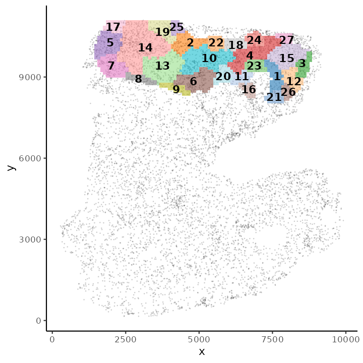

#### Select ROI by user

Alternatively, users can select ROIs based on their own research
interest (drawn by hand). This can be done using function
`selectRegion`. This function will open an interactive window with an
interactive plot for users to zoom-in/-out and select ROI using either a
rectangular or lasso selection tool. Users can also press the
`Export selected points` button to save the ROIs as object in the R
environment.

``` r

selectRegion(metadata(spe)$grid_density, x.col = "x_grid", y.col = "y_grid")
```

After closing the interactive window, the selected ROI has been saved as
a data.frame object named `sel_region` in the R environment.

``` r

sel_region
```

We can then use the `postSelRegion` to save the ROI in the metadata of
the SpatialExperiment object.

``` r

spe1 <- postSelRegion(spe, sel_region = sel_region)
metadata(spe1)$roi
```

Similarly, we can plot visualise the user-defined ROI with function
`plotROI`.

``` r

plotROI(spe1)
```

### Testing relationship between cell types

After defining ROIs, we can then test the relationship between any two
cell types within each ROI or overall but account for ROI variation
using a cubic spline or a linear fit. This can be done with function
`corrDensity`.

``` r

results <- corDensity(spe, roi = "Fibroblasts")
```

We can see the correlation between each pair of cell types in each
fibroblasts ROI.

``` r

results$ROI
```

    ## DataFrame with 48 rows and 9 columns
    ##       celltype1     celltype2         ROI     ngrid    cor.coef          t
    ##     <character>   <character> <character> <numeric>   <numeric>  <numeric>
    ## 1       B cells Breast cancer           1        31    0.338005   0.755462
    ## 2       B cells Breast cancer           2       160   -0.913986  -2.483606
    ## 3       B cells Breast cancer           3       325   -0.482294  -1.722597
    ## 4       B cells Breast cancer           4       369   -0.425421  -1.203010
    ## 5       B cells Breast cancer           5        87    0.437659   0.817755
    ## ...         ...           ...         ...       ...         ...        ...
    ## 44  Fibroblasts       T cells           4       369  0.06743410  0.2466458
    ## 45  Fibroblasts       T cells           5        87  0.60889057  2.2109896
    ## 46  Fibroblasts       T cells           6       173  0.18793427  0.5924011
    ## 47  Fibroblasts       T cells           7       315 -0.16143840 -0.6815605
    ## 48  Fibroblasts       T cells           8       373  0.00536088  0.0298639
    ##            df     p.Pos     p.Neg
    ##     <numeric> <numeric> <numeric>
    ## 1     4.42476  0.244103 0.7558973
    ## 2     1.21561  0.896728 0.1032725
    ## 3     9.78951  0.941830 0.0581705
    ## 4     6.54929  0.864675 0.1353253
    ## 5     2.82248  0.238409 0.7615909
    ## ...       ...       ...       ...
    ## 44   13.31707 0.4044718  0.595528
    ## 45    8.29697 0.0284087  0.971591
    ## 46    9.58525 0.2836464  0.716354
    ## 47   17.35906 0.7477454  0.252255
    ## 48   31.03191 0.4881834  0.511817

Or the correlation between each pair of cell types across all
fibroblasts ROI:

``` r

results$overall
```

    ## DataFrame with 6 rows and 5 columns
    ##       celltype1     celltype2   cor.coef      p.Pos     p.Neg
    ##     <character>   <character>  <numeric>  <numeric> <numeric>
    ## 1       B cells Breast cancer -0.1451816 0.59921852  0.135175
    ## 2       B cells   Fibroblasts  0.0324573 0.58293635  0.570772
    ## 3       B cells       T cells  0.4838632 0.00725754  0.996425
    ## 4 Breast cancer   Fibroblasts  0.0510354 0.31924365  0.876378
    ## 5 Breast cancer       T cells -0.1847721 0.29873370  0.113617
    ## 6   Fibroblasts       T cells  0.1756014 0.16264804  0.873024

We can also visualise the fitting using function `plotDensCor`.

``` r

plotDensCor(spe, celltype1 = "Breast cancer", celltype2 = "Fibroblasts")
```

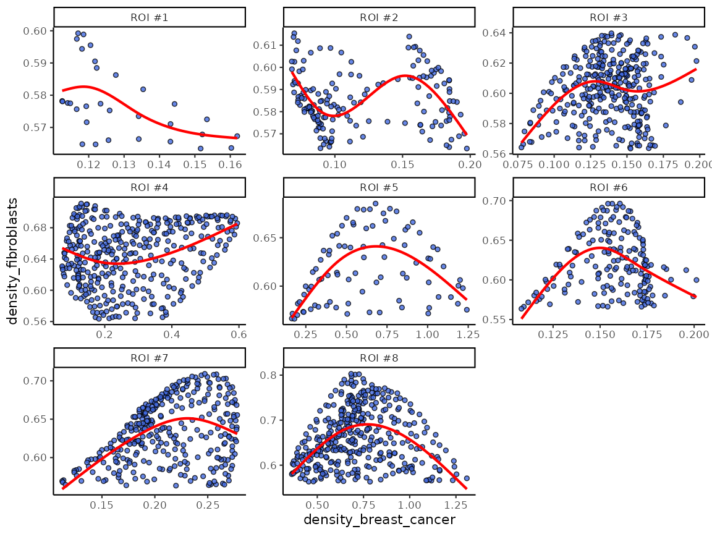

Or, we can visualise the statistics between each pair of cell types
using function `plotCorHeatmap` in the ROIs:

``` r

plotCorHeatmap(results$ROI)
```

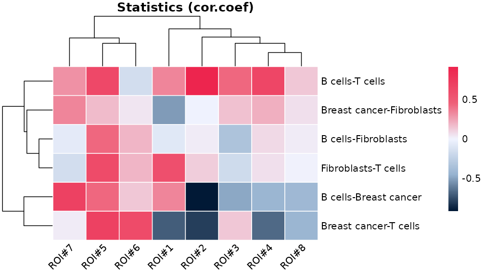

Or the correlation between cell type pairs across the whole slide:

``` r

plotCorHeatmap(results$overall)
```

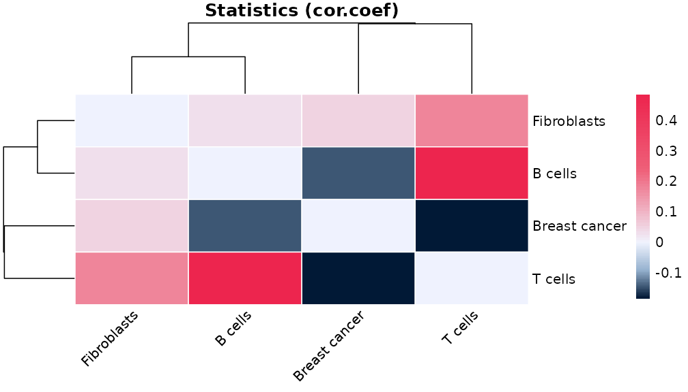

## Cell-based analysis

Based on the grid density, we can ask many biological question about the
data. For example, we would like to know if a certain cell type that are
located in high density of fibroblast cells are different to the same
cell type from a different level of fibroblast region.

### cell annotation based on grid density

To address this question, we first need to divide cells into different
levels of grid density. This can be done using a contour identification
strategy with function `getContour`.

``` r

spe <- getContour(spe, coi = "Fibroblasts", equal.cell = TRUE)
```

Different level of contour can be visualised with cells using
`plotContour`.

``` r

plotContour(spe, coi = "Fibroblasts")
```

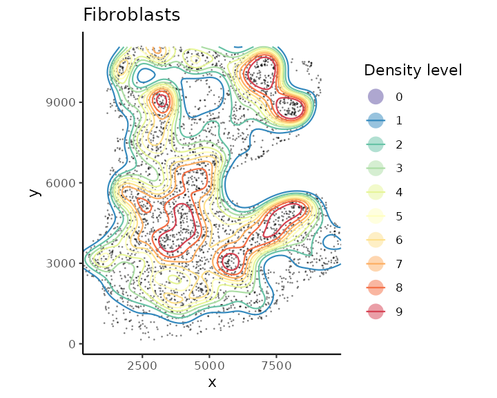

We can then annotate cells by their locations within each contour using
function `allocateCells`.

``` r

spe <- allocateCells(spe)
```

``` r

plotSpatial(spe, group.by = "fibroblasts_contour", pt.alpha = 0.5)
```

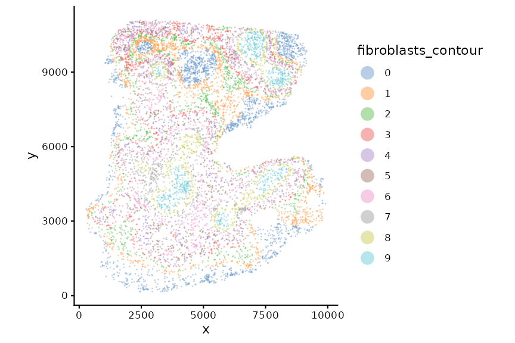

We can visualise cell type composition per level.

``` r

plotCellCompo(spe, contour = "Fibroblasts")
```

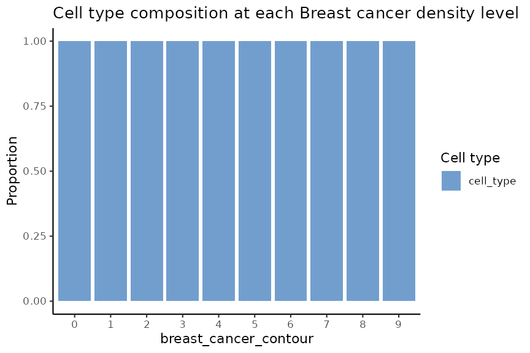

``` r

plotCellCompo(spe, contour = "Fibroblasts", roi = "Fibroblasts")
```

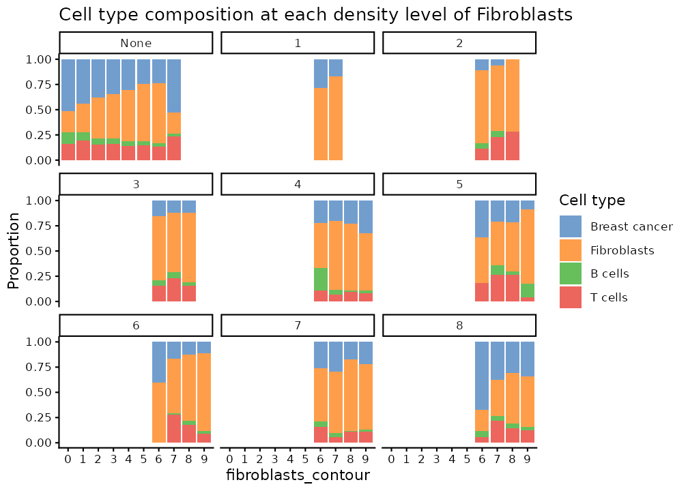

``` r

sessionInfo()
```

    ## R version 4.6.1 (2026-06-24)
    ## Platform: x86_64-pc-linux-gnu
    ## Running under: Ubuntu 24.04.4 LTS
    ## 
    ## Matrix products: default
    ## BLAS:   /usr/lib/x86_64-linux-gnu/openblas-pthread/libblas.so.3 
    ## LAPACK: /usr/lib/x86_64-linux-gnu/openblas-pthread/libopenblasp-r0.3.26.so;  LAPACK version 3.12.0
    ## 
    ## locale:
    ##  [1] LC_CTYPE=C.UTF-8       LC_NUMERIC=C           LC_TIME=C.UTF-8       
    ##  [4] LC_COLLATE=C.UTF-8     LC_MONETARY=C.UTF-8    LC_MESSAGES=C.UTF-8   
    ##  [7] LC_PAPER=C.UTF-8       LC_NAME=C              LC_ADDRESS=C          
    ## [10] LC_TELEPHONE=C         LC_MEASUREMENT=C.UTF-8 LC_IDENTIFICATION=C   
    ## 
    ## time zone: UTC
    ## tzcode source: system (glibc)
    ## 
    ## attached base packages:
    ## [1] stats4    stats     graphics  grDevices utils     datasets  methods  
    ## [8] base     
    ## 
    ## other attached packages:
    ##  [1] sf_1.1-2                    SpatialExperiment_1.22.0   
    ##  [3] SingleCellExperiment_1.34.0 SummarizedExperiment_1.42.0
    ##  [5] Biobase_2.72.0              GenomicRanges_1.64.0       
    ##  [7] Seqinfo_1.2.0               IRanges_2.46.0             
    ##  [9] S4Vectors_0.50.1            BiocGenerics_0.58.1        
    ## [11] generics_0.1.4              MatrixGenerics_1.24.0      
    ## [13] matrixStats_1.5.0           scider_1.9.7               
    ## [15] ggplot2_4.0.3              
    ## 
    ## loaded via a namespace (and not attached):
    ##   [1] DBI_1.3.0              deldir_2.0-4           rlang_1.3.0           
    ##   [4] magrittr_2.0.5         snakecase_0.11.1       otel_0.2.0            
    ##   [7] e1071_1.7-17           compiler_4.6.1         spatstat.geom_3.8-2   
    ##  [10] mgcv_1.9-4             systemfonts_1.3.2      fftwtools_0.9-11      
    ##  [13] vctrs_0.7.3            stringr_1.6.0          pkgconfig_2.0.3       
    ##  [16] fastmap_1.2.0          magick_2.9.1           XVector_0.52.0        
    ##  [19] lwgeom_0.2-17          labeling_0.4.3         promises_1.5.0        
    ##  [22] rmarkdown_2.31         ragg_1.5.2             purrr_1.2.2           
    ##  [25] xfun_0.60              cachem_1.1.0           jsonlite_2.0.0        
    ##  [28] goftest_1.2-3          later_1.4.8            DelayedArray_0.38.2   
    ##  [31] spatstat.utils_3.2-4   R6_2.6.1               bslib_0.12.0          
    ##  [34] stringi_1.8.7          RColorBrewer_1.1-3     spatstat.data_3.1-9   
    ##  [37] spatstat.univar_3.2-0  lubridate_1.9.5        jquerylib_0.1.4       
    ##  [40] Rcpp_1.1.2             knitr_1.51             tensor_1.5.1          
    ##  [43] splines_4.6.1          httpuv_1.6.17          Matrix_1.7-5          
    ##  [46] igraph_2.3.3           timechange_0.4.0       tidyselect_1.2.1      
    ##  [49] abind_1.4-8            yaml_2.3.12            spatstat.random_3.5-1 
    ##  [52] spatstat.explore_3.8-2 lattice_0.22-9         tibble_3.3.1          
    ##  [55] shiny_1.14.0           withr_3.0.3            S7_0.2.2              
    ##  [58] evaluate_1.0.5         desc_1.4.3             units_1.0-1           
    ##  [61] proxy_0.4-29           polyclip_1.10-7        pillar_1.11.1         
    ##  [64] KernSmooth_2.23-26     plotly_4.12.1          dbscan_1.2.5          
    ##  [67] scales_1.4.0           xtable_1.8-8           class_7.3-23          
    ##  [70] glue_1.8.1             janitor_2.2.1          pheatmap_1.0.13       
    ##  [73] tools_4.6.1            hexDensity_1.4.10      hexbin_1.28.6         
    ##  [76] data.table_1.18.4      fs_2.1.0               grid_4.6.1            
    ##  [79] tidyr_1.3.2            nlme_3.1-169           fastmatrix_0.6-6      
    ##  [82] cli_3.6.6              spatstat.sparse_3.2-0  textshaping_1.0.5     
    ##  [85] S4Arrays_1.12.0        viridisLite_0.4.3      dplyr_1.2.1           
    ##  [88] gtable_0.3.6           SpatialPack_0.4-1      sass_0.4.10           
    ##  [91] digest_0.6.39          classInt_0.4-11        SparseArray_1.12.2    
    ##  [94] rjson_0.2.23           htmlwidgets_1.6.4      farver_2.1.2          
    ##  [97] htmltools_0.5.9        pkgdown_2.2.1          lifecycle_1.0.5       
    ## [100] httr_1.4.8             mime_0.13
